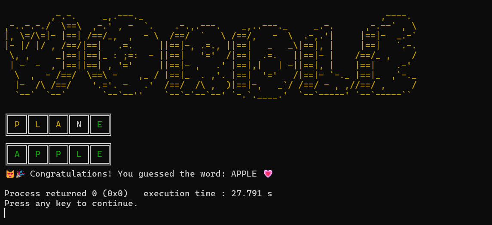

# Wordle Game (C++)

## 📌 Overview
This is a **Wordle** game implemented in C++ that allows players to guess a five-letter word within six attempts. The game provides feedback on each guess using colors:
- **🟩 Green**: Correct letter in the correct position.
- **🟨 Yellow**: Correct letter in the wrong position.
- **⬜ Gray**: Incorrect letter.

The game features an **enhanced ASCII UI** with box-drawing characters for a polished look. It runs in the console and supports both Windows and Linux.

---

## ✨ Features
- **Interactive Gameplay**: Play Wordle directly in the console.
- **Color-coded Feedback**: Highlights correct, partially correct, and incorrect letters.
- **Extended ASCII UI**: Uses box-drawing characters for a clean layout.
- **Random Word Selection**: Each game selects a random word from a predefined list.
- **Cross-platform Support**: Works on Windows and Linux/macOS.
- **User-friendly Interface**: Easy to navigate and play.

---

## 🛠 Installation & Setup
### Prerequisites
Ensure you have the following installed:
- **C++ Compiler** (GCC, Clang, or MSVC)
- **CMake** (Optional for advanced builds)

### Steps
1. **Clone the Repository**
   ```sh
   git clone https://github.com/NathanCordeiro/wordle.git
   cd wordle-cpp
   ```

2. **Compile the Code**
   On **Windows (MinGW or MSVC)**:
   ```sh
   g++ wordle.cpp -o wordle.exe
   ```
   On **Linux/macOS**:
   ```sh
   g++ wordle.cpp -o wordle
   ```

3. **Run the Game**
   ```sh
   ./wordle
   ```
   *(Use `wordle.exe` on Windows)*

---

## 🎮 How to Play
1. Start the game.
2. Enter a **5-letter word** as a guess.
3. View the **color-coded feedback**:
   - 🟩 **Green** = Correct letter in the correct position.
   - 🟨 **Yellow** = Correct letter in the wrong position.
   - ⬜ **Gray** = Incorrect letter.
4. Keep guessing until you find the correct word or run out of attempts.
5. **Win or Lose**: The correct word is revealed at the end.

---

## 🖥️ Demo (UI Preview)

- **Green letters** ✅ → Correct position  
- **Yellow letters** 🟡 → Present but wrong position  

---

## ⚙️ Technical Details
- **Programming Language**: C++
- **Libraries Used**: Standard C++ (iostream, vector, string, algorithm, cstdlib, ctime)
- **Word Selection**: Uses a hardcoded word list (can be expanded with a dictionary API)
- **UTF-8 Console Support**: Uses `SetConsoleOutputCP(CP_UTF8);` on Windows

---

## 🤝 Contribution
Want to improve this project? Contributions are welcome!
1. **Fork the repository**
2. **Create a new branch**
   ```sh
   git checkout -b feature-branch
   ```
3. **Commit changes & push**
   ```sh
   git commit -m "Added new feature"
   git push origin feature-branch
   ```
4. **Open a Pull Request**

---

## 📜 License
This project is licensed under the [**MIT License**](LICENSE).

---

